# LaTeq
**Compile standalone LaTeX equations into PDF, PNG, or JPEG with a simple command.**

## 📋 Table of Contents
- [What is LaTeq?](#-what-is-lateq)
- [Features](#-features)
- [Installation](#-installation)
  - [Automatic Installation](#automatic-installation-recommended)
  - [Manual Installation](#manual-installation)
  - [Dependencies](#-dependencies)
- [Usage](#-usage)
  - [Basic Examples](#basic-examples)
  - [Advanced Examples](#advanced-examples-with-packages)
- [Package Support](#-package-support)
- [Output Formats](#-output-formats)
- [Error Handling](#-error-handling)
- [Examples Gallery](#-examples-gallery)
- [Troubleshooting](#-troubleshooting)
- [Notes](#-notes)
- [Uninstallation](#-uninstallation)

## 🧮 What is LaTeq?
LaTeq is a command-line tool that lets you compile LaTeX math equations on the fly. It's perfect for generating beautiful equations for slides, documents, or image-based content. It supports PDF, PNG, and JPEG outputs and opens the result directly.

**Cross-platform:** Works identically on Linux, macOS, and Windows after installation.

## ✨ Features
- **Multiple output formats**: PDF (default), PNG, and JPEG
- **Custom filename support**: Specify your own filename with `--filename`
- **Custom package support**: Add any LaTeX packages you need
- **Interactive error handling**: Detailed debugging options when compilation fails
- **Automatic file opening**: Generated files open in your default viewer
- **Flexible output locations**: Save files wherever you want
- **Temporary file separation**: Working files stay in system temp directory, only final output goes to your specified directory

## 🚀 Installation

### Automatic Installation (Recommended)

#### 🐧 Linux / macOS
Install LaTeq system-wide with a single command:

```bash
curl -sSL https://raw.githubusercontent.com/MathieuMichels/LaTeq/main/install.sh | bash
```

This script will:
- ✅ Check and install all dependencies (texlive, imagemagick)
- ✅ Download the latest LaTeq script from GitHub
- ✅ Install it system-wide to `/usr/local/bin/LaTeq`
- ✅ Test the installation
- ✅ Work on Debian/Ubuntu, RedHat/CentOS, and Arch Linux

#### 🪟 Windows
Install LaTeq system-wide with a single PowerShell command (run as Administrator):

```powershell
powershell -Command "& {Invoke-WebRequest -Uri 'https://raw.githubusercontent.com/MathieuMichels/LaTeq/main/install-windows.ps1' -UseBasicParsing | Invoke-Expression}"
```

This script will:
- ✅ Check for dependencies (recommends MiKTeX/TeX Live and ImageMagick)
- ✅ Download the latest LaTeq script from GitHub (PowerShell)
- ✅ Install it system-wide to `C:\Program Files\LaTeq`
- ✅ Add to system PATH for easy access
- ✅ Create a PowerShell function for simplified usage
- ✅ Set PowerShell execution policy if needed
- ✅ Test the installation

After installation, you can use `LaTeq "equation"` directly from any terminal!

### Manual Installation

#### 🐧 Linux / macOS
If you prefer manual installation or want more control:

```bash
# Download the script
wget https://raw.githubusercontent.com/MathieuMichels/LaTeq/main/LaTeq.sh

# Make it executable
chmod +x LaTeq.sh

# Install system-wide
sudo cp LaTeq.sh /usr/local/bin/LaTeq
```

#### 🪟 Windows
For manual Windows installation (run as Administrator):

```powershell
# Download the script
Invoke-WebRequest -Uri "https://raw.githubusercontent.com/MathieuMichels/LaTeq/main/LaTeq.ps1" -OutFile "LaTeq.ps1"

# Create installation directory
New-Item -ItemType Directory -Path "C:\Program Files\LaTeq" -Force

# Copy file
Copy-Item "LaTeq.ps1" "C:\Program Files\LaTeq\"

# Add to PATH
$path = [Environment]::GetEnvironmentVariable("Path", "Machine")
[Environment]::SetEnvironmentVariable("Path", "$path;C:\Program Files\LaTeq", "Machine")
```

### 🧪 Testing the Installation

**After automatic installation:**
```bash
LaTeq "x^2 + \frac{1}{2}" --jpeg
```

**For manual testing before system-wide installation:**
```bash
# Linux/macOS
./LaTeq.sh "x^2 + \frac{1}{2}" --jpeg

# Windows
.\LaTeq.ps1 "x^2 + \frac{1}{2}" --jpeg
```

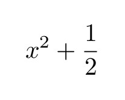

Make sure the output is opened and appears as expected.

### 🔧 Dependencies
The automatic installer handles these for you, but if installing manually:

#### 🐧 Linux / macOS
- `texlive` (for compiling LaTeX)
- `imagemagick` (for converting PDFs to images)

Install on Debian-based systems:
```bash
sudo apt install texlive imagemagick
```

For full LaTeX functionality with all packages:
```bash
sudo apt install texlive-full
```

#### 🪟 Windows
- **MiKTeX** or **TeX Live** (for compiling LaTeX)
- **ImageMagick** (for converting PDFs to images)
- **PowerShell** (included with Windows)

Install dependencies:
- **MiKTeX**: Download from [miktex.org](https://miktex.org/download)
- **TeX Live**: Download from [tug.org/texlive](https://www.tug.org/texlive/windows.html)
- **ImageMagick**: Download from [imagemagick.org](https://imagemagick.org/script/download.php#windows)

Or use **Chocolatey** package manager:
```powershell
choco install miktex imagemagick
```

## 🛠 Usage

LaTeq works identically on all platforms after installation:

```bash
LaTeq "equation" [--png|--jpeg] [--output "path"] [--filename "name"] [--packages "pkg1,pkg2,pkg3"] [--dpi "value"]
```

**Parameters:**
- `equation` - Your LaTeX equation (required)
- `--png` - Export as PNG image
- `--jpeg` - Export as JPEG image  
- `--output "path"` - Directory to save the file
- `--filename "name"` - Custom filename (without extension)
- `--packages "pkg1,pkg2,pkg3"` - Additional LaTeX packages to include
- `--dpi "value"` - Resolution for image export (default: 450)

By default, files are saved in the temporary directory and opened automatically. You can specify a different output directory with `--output`.

### Basic Examples

Simple linear equation:
```bash
LaTeq "3x+1"
```
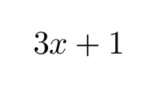

Pythagorean theorem:
```bash
LaTeq "x^2 + y^2 = z^2" --jpeg
```
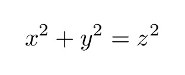

Integral calculation:
```bash
LaTeq "\int_0^1 x^2 dx" --jpeg --output ~/Documents
```
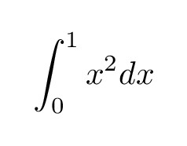

### Advanced Examples with Packages

TikZ graphics:
```bash
LaTeq "\tikz \draw (0,0) circle (1cm);" --packages "tikz" --jpeg --filename "circle"
```


Chemistry formulas:
```bash
LaTeq "\chemfig{H-C(-[2]H)(-[6]H)-H}" --packages "chemfig,xcolor" --jpeg --filename "methane"
```
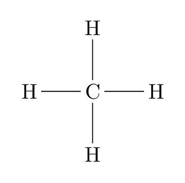

Complex diagrams with multiple packages:
```bash
LaTeq '\begin{tikzpicture} \node[draw,fill=blue!20] {Hello}; \end{tikzpicture}' --packages "tikz,xcolor" --jpeg --output ~/Desktop --filename "hello_box"
```


Physics equations:
```bash
LaTeq "\hbar \omega = E" --packages "physics"
```
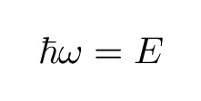

Custom fonts:
```bash
LaTeq "E = mc^2" --packages "newtxtext,newtxmath" --jpeg --filename "einstein_custom"
```
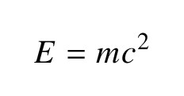

More complex:
```bash
LaTeq "\boxed{\underbrace{\rho\bigl(\tfrac{\partial\mathbf{u}}{\partial t}+(\mathbf{u}\cdot\nabla)\mathbf{u}\bigr)}_{\color{red}\text{Inertia}}\;=\; -\underbrace{\nabla p}_{\color{blue}\text{Pressure}}\;+\;\underbrace{\mu\,\nabla^2\mathbf{u}}_{\color{green}\text{Viscous}}\;+\;\underbrace{\mathbf{f}}_{\color{orange}\text{Body Force}}}" --packages "amsmath,mathtools,xcolor"
```
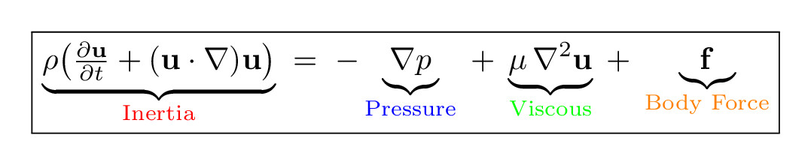

## 📦 Package Support
LaTeq includes these packages by default:
- `amsmath` - Advanced math environments
- `amssymb` - Mathematical symbols  
- `amsfonts` - Mathematical fonts

You can add additional packages using the `--packages` flag with a comma-separated list:
```bash
LaTeq "equation" --packages "tikz,pgfplots,xcolor"
```

Popular packages you might want to use:
- `tikz` - Graphics and diagrams
- `pgfplots` - Plotting
- `chemfig` - Chemical formulas
- `physics` - Physics notation
- `siunitx` - SI units
- `xcolor` - Colors
- `mathtools` - Extended math tools

## 📤 Output Formats
* **PDF** (default) - Vector format, perfect for documents
* **PNG** (`--png`) - Raster format with transparency
* **JPEG** (`--jpeg`) - Raster format, smaller file size

The generated files are opened automatically using your system's default viewer.

## 🐛 Error Handling
When compilation fails, LaTeq provides an interactive menu with these options:

1. **Show LaTeX log** - View detailed error messages
2. **Show generated .tex file** - Inspect the LaTeX code
3. **Save log file to disk** - Keep the log for later analysis  
4. **Save .tex file to disk** - Save the LaTeX source for debugging
5. **Show both log and .tex file** - Display both at once
6. **Clean up and exit** - Remove temporary files and exit

This makes it easy to debug complex equations or package conflicts.

## ⚠️ Notes
* You must use escaped LaTeX in the command-line string (e.g., `\\frac` instead of `\frac`) or write the equation between quotes (e.g., `LaTeq "\frac{3x+1}{2}"` or `LaTeq \\frac{3x+1}{2}`)
* If `convert` is missing, install ImageMagick as shown above
* For complex equations with custom commands, you can define them inline:
  ```bash
  LaTeq "\newcommand{\mysum}{\displaystyle\sum} \mysum_{i=1}^n x_i"
  ```
  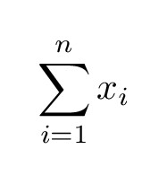

**Note:** All usage examples in this README work identically on Linux, macOS, and Windows after system-wide installation.

## 🔍 Troubleshooting
- **Package not found**: Install `texlive-full` or the specific package collection
- **Command not found**: The LaTeX command might be undefined - check spelling or add required packages
- **Compilation hangs**: Use Ctrl+C to stop and check your equation syntax
- **No output file**: Check the interactive error menu for details

## 📝 Examples Gallery

### Mathematics

Basel problem:
```bash
LaTeq "\sum_{n=1}^{\infty} \frac{1}{n^2} = \frac{\pi^2}{6}"
```
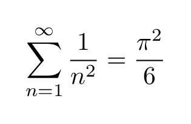

Stokes theorem:
```bash
LaTeq "\oint_C \mathbf{F} \cdot d\mathbf{r} = \iint_S (\nabla \times \mathbf{F}) \cdot d\mathbf{S}"
```
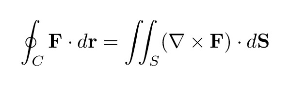

### Physics

Einstein's mass-energy equivalence:
```bash
LaTeq "E = mc^2" --packages "physics"
```
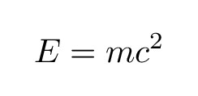

Schrödinger equation:
```bash
LaTeq "\hat{H}\psi = E\psi" --packages "physics"
```


### Chemistry

Acid-base reaction:
```bash
LaTeq "\ce{H2SO4 + 2NaOH -> Na2SO4 + 2H2O}" --packages "mhchem"
```
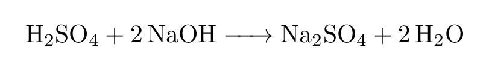

Phenol structure:
```bash
LaTeq "\chemfig{*6(=-=(-OH)-=-=-)}" --packages "chemfig"
```
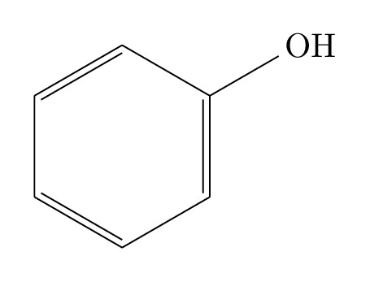

### Graphics

Force vector diagram:
```bash
LaTeq "\tikz[scale=0.8] \draw[->] (0,0) -- (2,1) node[right] {\$F\$};" --packages "tikz"
```
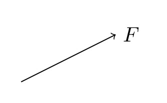

## 🗑️ Uninstallation

### 🐧 Linux / macOS
To completely remove LaTeq from your Linux or macOS system (but keep dependencies like TeX Live and ImageMagick):

**Automatic uninstallation (recommended):**
```bash
curl -sSL https://raw.githubusercontent.com/MathieuMichels/LaTeq/main/uninstall.sh | bash
```

This script will:
- ✅ Find and remove all LaTeq installations (system-wide and user-local)
- ✅ Clean up temporary files and cache directories
- ✅ Verify complete removal
- ✅ Keep your LaTeX dependencies (TeX Live, ImageMagick, etc.)

**Available options:**
```bash
# Silent uninstall without prompts
bash <(curl -sSL https://raw.githubusercontent.com/MathieuMichels/LaTeq/main/uninstall.sh) --force

# Remove LaTeq AND all dependencies (TeX Live, ImageMagick)
bash <(curl -sSL https://raw.githubusercontent.com/MathieuMichels/LaTeq/main/uninstall.sh) --remove-dependencies

# Show help with all options
bash <(curl -sSL https://raw.githubusercontent.com/MathieuMichels/LaTeq/main/uninstall.sh) --help
```

**Manual uninstallation:**
If you prefer manual removal:

```bash
# Simple removal
sudo rm -f /usr/local/bin/LaTeq

# Complete cleanup (removes LaTeq and temporary files)
sudo rm -f /usr/local/bin/LaTeq /usr/bin/LaTeq
rm -rf /tmp/lateq-* /tmp/LaTeq

# Verify removal
if ! command -v LaTeq >/dev/null 2>&1; then
    echo "LaTeq successfully uninstalled!"
else
    echo "Warning: LaTeq command still found in PATH"
    which LaTeq  # Shows remaining location
fi
```

### 🪟 Windows
To completely remove LaTeq from your Windows system (but keep dependencies like MiKTeX and ImageMagick):

**Automatic uninstallation (recommended):**
```powershell
powershell -Command "& {Invoke-WebRequest -Uri 'https://raw.githubusercontent.com/MathieuMichels/LaTeq/main/uninstall-windows.ps1' -UseBasicParsing | Invoke-Expression}"
```

This script will:
- ✅ Remove LaTeq installation directory (`C:\Program Files\LaTeq`)
- ✅ Remove any legacy LaTeq.bat files from previous installations
- ✅ Remove LaTeq paths from system PATH
- ✅ Remove LaTeq function from PowerShell profile (optional with `--KeepProfile`)
- ✅ Clean up temporary files
- ✅ Keep your LaTeX dependencies (MiKTeX, ImageMagick, etc.)

**Available options:**
```powershell
# Keep the PowerShell profile function
powershell -Command "& {Invoke-WebRequest -Uri 'https://raw.githubusercontent.com/MathieuMichels/LaTeq/main/uninstall-windows.ps1' -UseBasicParsing | Invoke-Expression}" -KeepProfile

# Force uninstall without confirmation
powershell -Command "& {Invoke-WebRequest -Uri 'https://raw.githubusercontent.com/MathieuMichels/LaTeq/main/uninstall-windows.ps1' -UseBasicParsing | Invoke-Expression}" -Force
```

**Manual uninstallation:**
If you need to uninstall manually, the dependencies can be removed with your system's package manager. Use the commands above or consult your distribution's documentation.